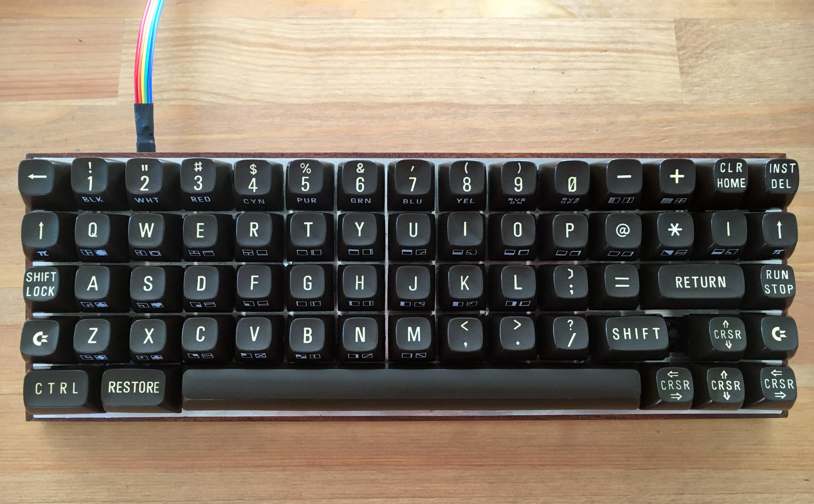
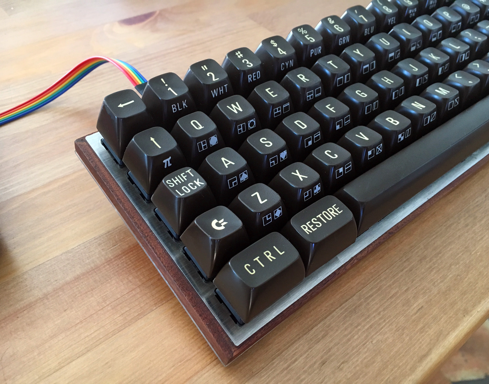
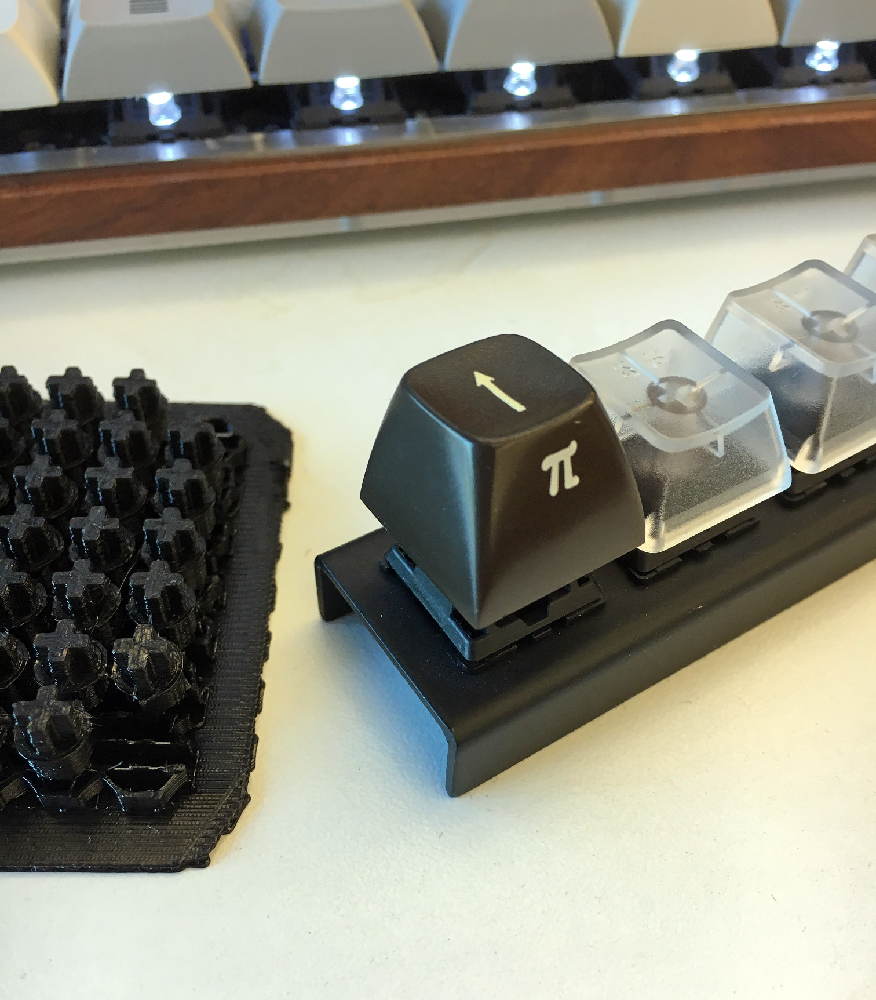
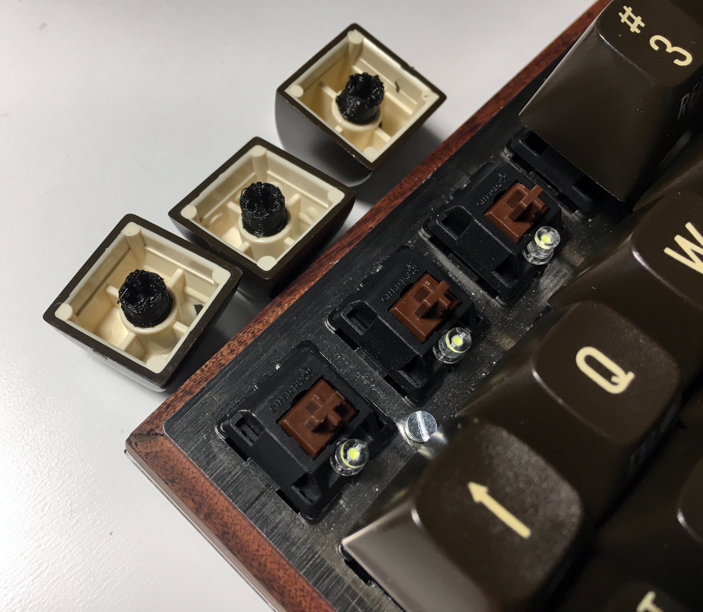
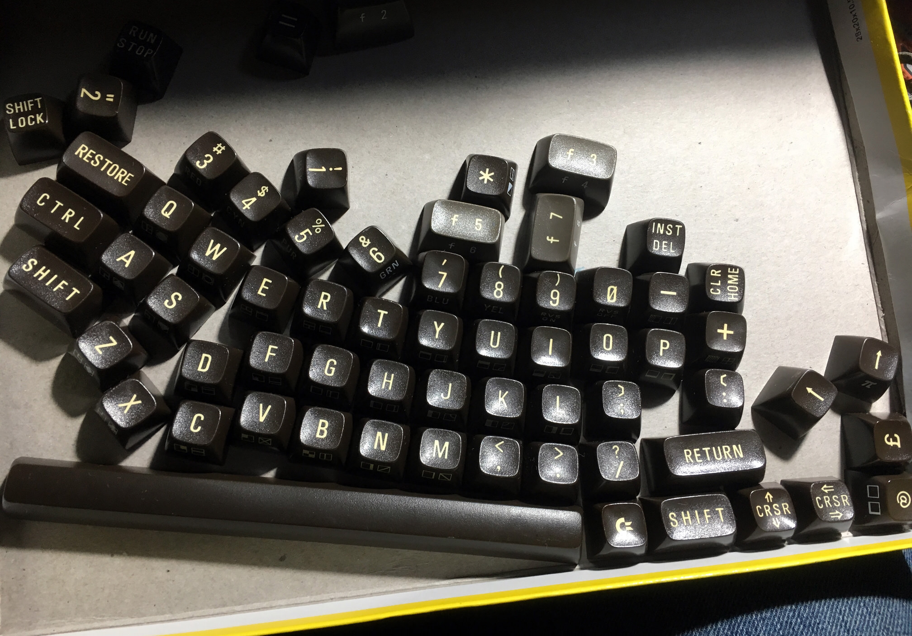
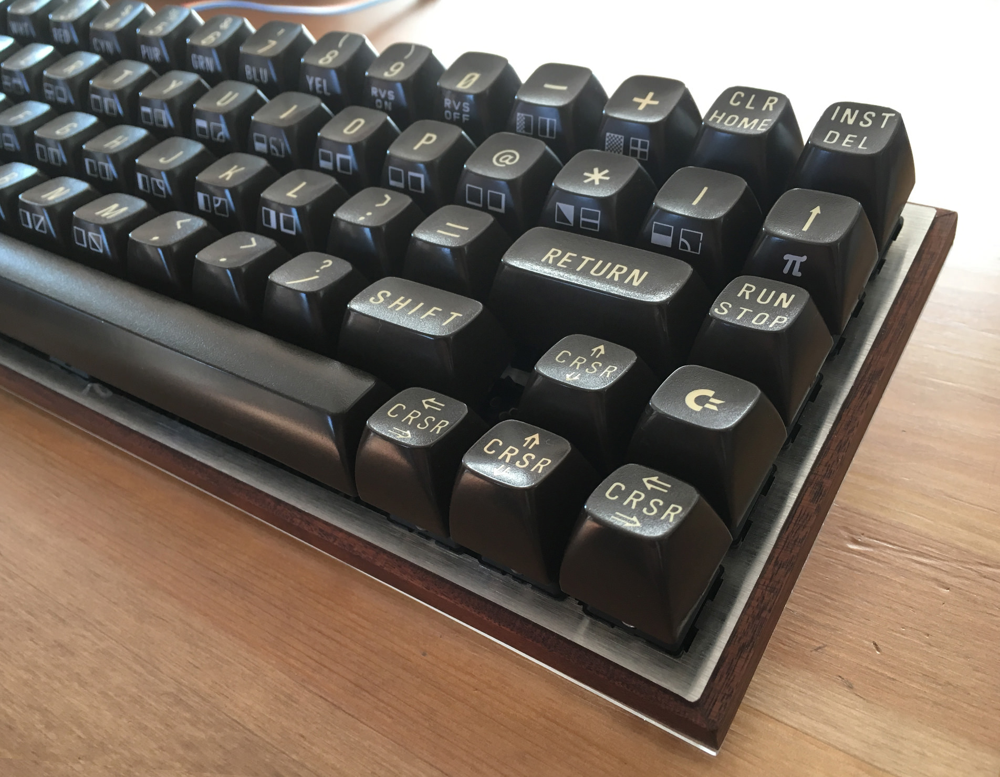
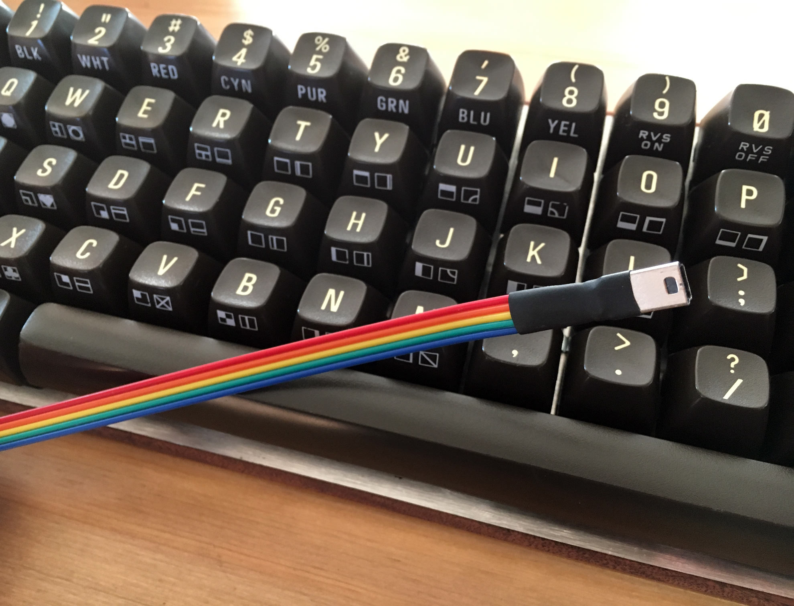
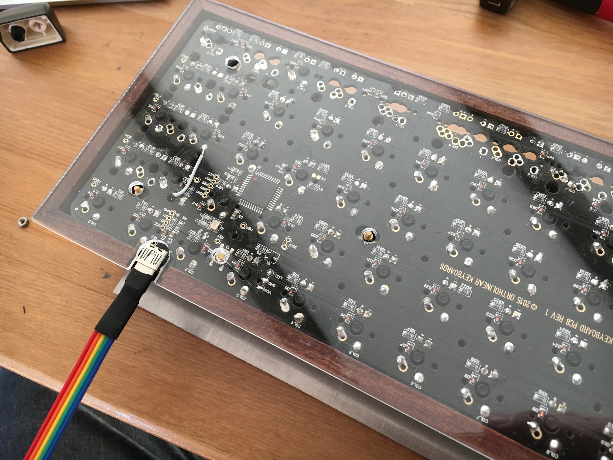
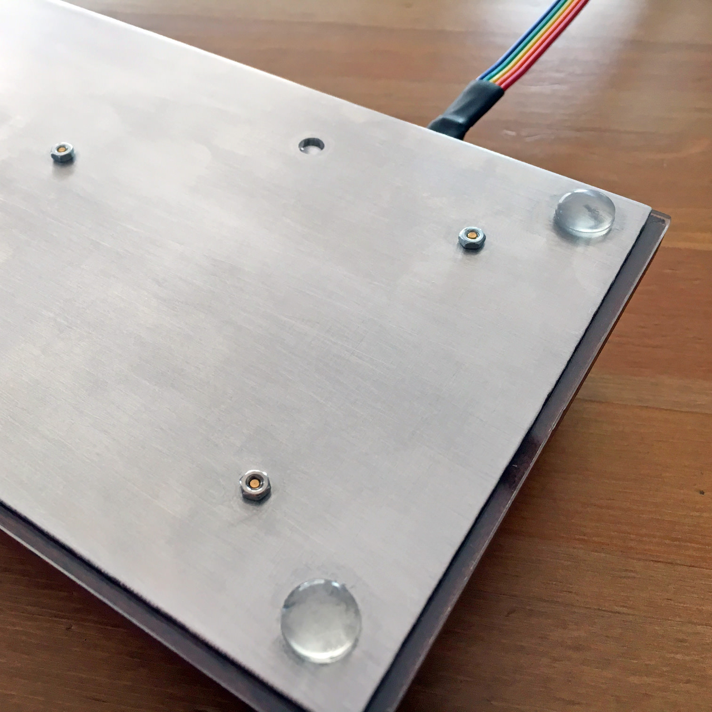
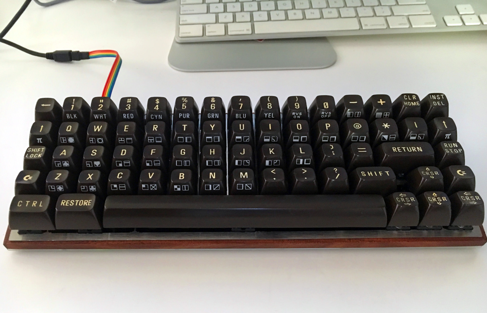

# Commodore 64 Mechanical Keyboard

I converted my ortholinear Atomic Keyboard to use Commodore 64 keycaps on Cherry MX switches.  Exactly 64 keys, with a 9U  s p a c e b a r . . .

Commodore keys are sculpted, so tried to use the sanest layout with the keys available.  I made a Commodore-themed cable extender.

3d printed adapters are from https://github.com/tltx/MeC64/tree/master/keycap_adapter

Print quality is pretty rough but they are straight and work great.

Washed and cleaned keys from my circa 1983 Commodore 64.

I used keys from two C64s to cover cursors, C= key, etc.

I made a Commodore-themed USB extender out of ribbon cable and heat shrink.

Case is DIY Walnut and plexiglas...

with a DIY aluminum bottom.

That 9U Spacebar!  Original stabilizer clipped to plate works well.   Massive kudos to OLKB (https://olkb.com) fo designing the amazingly flexible Atomic, am amazed the layout fits the PCB with no modifications.
